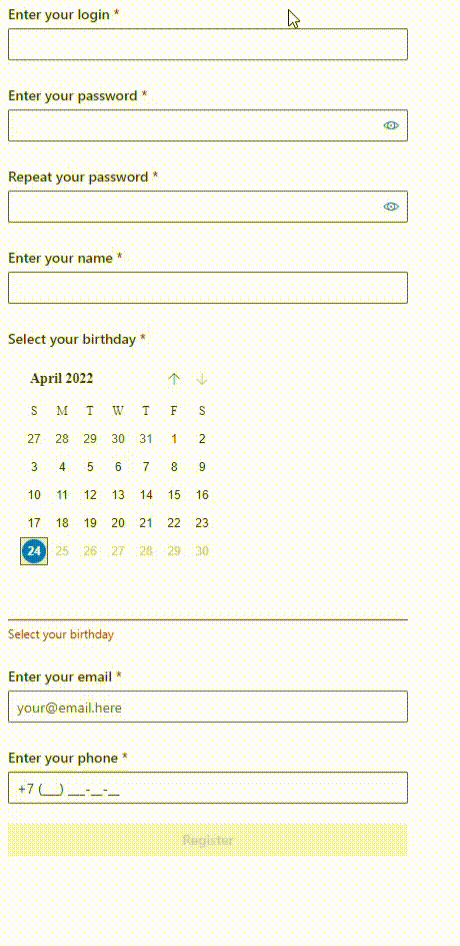

<h1 class="code-line" data-line-start=0 data-line-end=1 >User registration</h1>
<h5 class="code-line" data-line-start=1 data-line-end=2 >Needed data:</h5>
<ul>
<li class="has-line-data" data-line-start="2" data-line-end="3">Login (should be unique)</li>
<li class="has-line-data" data-line-start="3" data-line-end="4">Password with confirmation</li>
<li class="has-line-data" data-line-start="4" data-line-end="5">Name</li>
<li class="has-line-data" data-line-start="5" data-line-end="6">Date of birth</li>
<li class="has-line-data" data-line-start="6" data-line-end="7">Email</li>
<li class="has-line-data" data-line-start="7" data-line-end="8">Phone</li>
</ul>
<h6 class="code-line" data-line-start=8 data-line-end=9 >There is a backup of the test database in file <code>tekora.bak</code>. It has three users <code>login1</code>, <code>login2</code> and <code>login3</code>.</h6>
<h5 class="code-line" data-line-start=9 data-line-end=10 >Backend based on:</h5>
<ul>
<li class="has-line-data" data-line-start="10" data-line-end="11">ASP .NET Core</li>
<li class="has-line-data" data-line-start="11" data-line-end="12">Entity Framework + local SQL base</li>
</ul>
<h5 class="code-line" data-line-start=12 data-line-end=13 >Frontend based on:</h5>
<ul>
<li class="has-line-data" data-line-start="13" data-line-end="14">TypeScript + React</li>
<li class="has-line-data" data-line-start="14" data-line-end="15">Fluent UI for, well, UI</li>
</ul>
<h5 class="code-line" data-line-start=15 data-line-end=16 >Result:</h5>
<ul>
<li class="has-line-data" data-line-start="16" data-line-end="17">???</li>
<li class="has-line-data" data-line-start="17" data-line-end="18">typical frontend code and UI built by backender!</li>
</ul>

